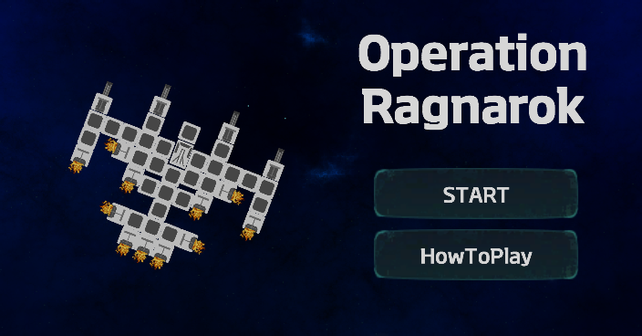
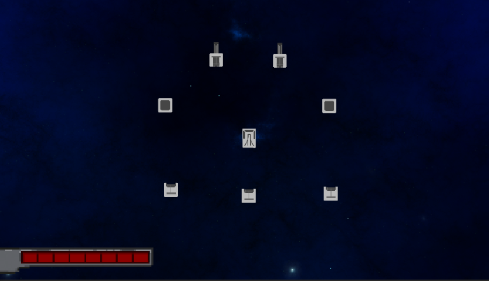
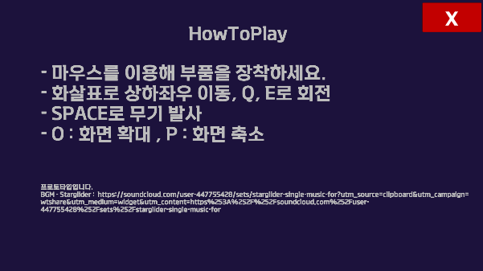
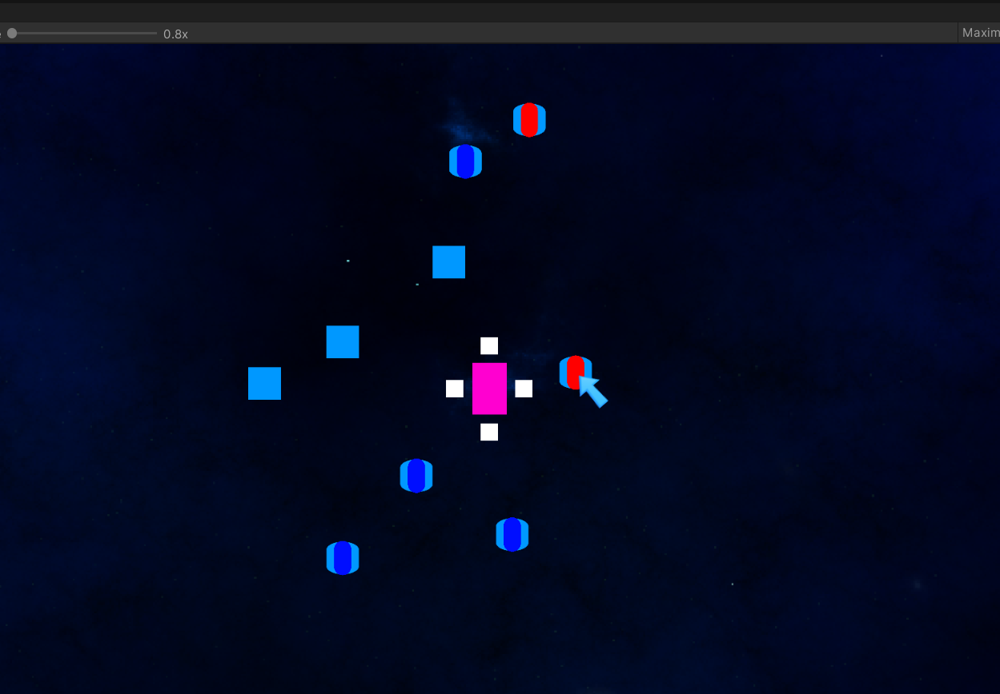

# Operation Ragnarok

건국대학교 게임 개발 경진대회 2021 하반기 출품작

---

## 🎮 게임 소개

**우주선 키우기** 방식의 탑뷰 액션 게임.

우주를 떠돌며 적을 처치하고, 쓰러진 적의 부품을 **마우스 드래그**로 내 우주선에 직접 붙여가며 점점 거대한 우주선으로 키워나가는 게임입니다.

---

## 🕹 핵심 메커니즘

- **탑뷰 이동** — 우주 공간을 자유롭게 이동
- **전투** — 적 우주선과 교전
- **파츠 조립** — 격파한 적의 부품을 마우스 드래그로 내 우주선에 부착
- **성장** — 부품이 쌓일수록 우주선이 점점 커지고 강해짐

---

## 🛠 기술 스택

- **Engine**: Unity
- **Language**: C#
- **Genre**: Top-view Action

---

## 👤 개발

- **기획 · 디자인 · 개발** 1인 전담
- 건국대학교 EDGE 게임 개발 경진대회 2021 하반기 출품

---

## 📸 스크린샷

### 타이틀 화면

### 인게임 플레이
 

### 개발 과정 (Unity Editor)

---

## 📥 다운로드

---

## 🎬 시연 영상

<!-- 영상 링크를 여기에 추가해주세요 -->
> YouTube 링크 또는 GIF를 추가하세요.

